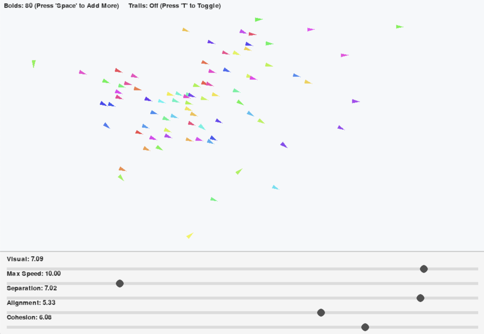

# BOIDS - Bird Flocking Simulation Program

## Preface and Notes
I became interested in this simulation after learning about the BOIDS program in my COGS 100 class, Cyborgs, Now and in the Future. The program was first developed by Craig Reynolds in 1986 and aimed to understand flocking bird behavior as an emergent property. I decided to create my own version of the simulation in Python, utilizing the Pygame library and vectors to simulate birds on a display. Some inspiration was taken from Ben Eater, who created a web based version of the BOIDS algorithm in JavaScript, which can be found [here](https://eater.net/boids).

## The Big Question: How Do Birds Flock?

Bird flocking appears highly complex and coordinated, yet it emerges from very simple local rules followed by each individual bird. The BOIDS model demonstrates how complex and collective behaviors can arise without central control, producing seemingly infinite flocking patterns from a small set of rules.

This project models flocking behavior using three simple programs applied to every bird (agent) in the system:
1. Separation - Each bird maintains a reasonable distance from other birds to prevent collisions.

2. Alignment - Birds attempt to align their movement with the average direction of nearby birds.

3. Cohesion - Each bird tries to stay close to the group by moving toward the average position of nearby birds.

## Emergence and Complexity

This model demonstrates how complexity emerges from simple components. None of the individual rules contain complex flocking behavior on their own. However, when combined and applied locally across many birds, coordinated flocking patterns emerge at the system level.

This is a defining characteristic of emergence. The final behavior cannot be explicitly programmed in detail. Instead, it must be discovered by identifying simple rules that interact to produce complex outcomes.
